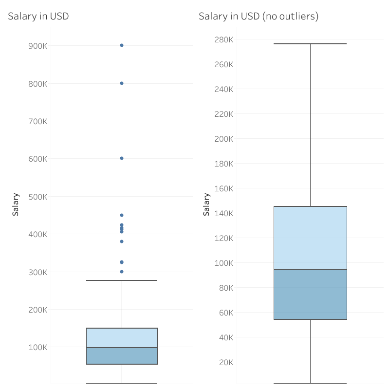
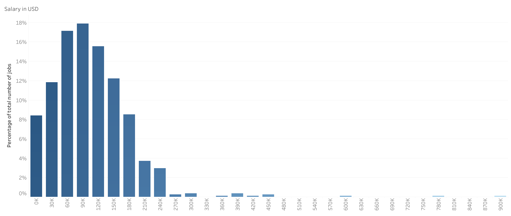
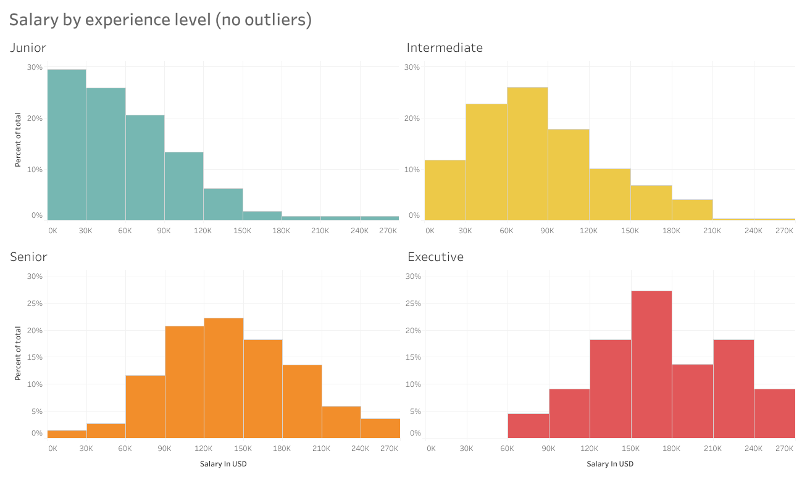
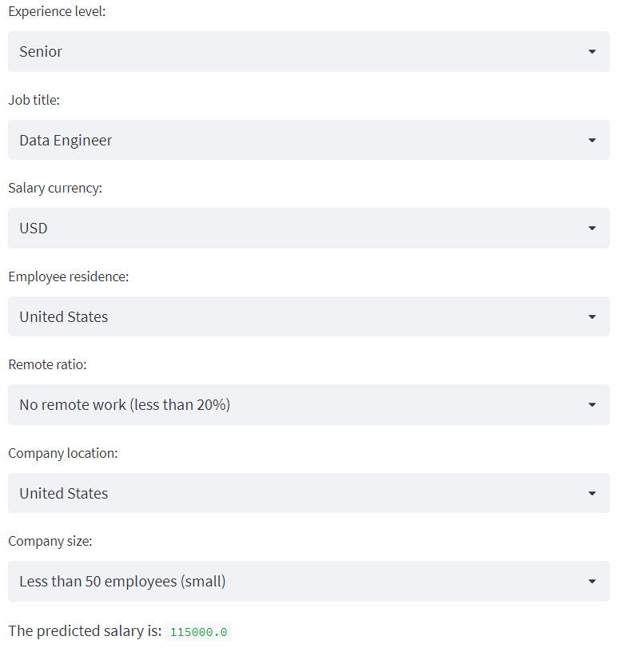

# Data science jobs - comprehensive analysis and salary prediction

## Summary

The objective of this project is simple: to get a better grasp on the current market for data related jobs worldwide. This is done in 2 steps: In the first one, a comprehensive EDA (Exploratory Data Analysis) is performed using multiple visualization tools to help the reader follow along. Pretty much all aspects regarding data related jobs that can be analyzed are (experience level of employee, job title, company location, salary and many more) but the focus of the EDA lies on the job salaries. To further understand the market, some machine learning techniques are used to create a predictive model for those salaries. The predictive model is then deployed online so anyone can use it without having to meddle with the code.

## Data

All data used in this project is gathered from [ai-jobs.net](https://ai-jobs.net/). The purpose of the site is to make global salaries in AI/ML and Big Data a bit more open and transparent. It operates similarly to the well-known website [glassdoor.com](https://glassdoor.com/), as people voluntarily and anonymously post their job details. The two main differences are that ai-jobs only gathers information on data related jobs and that all data gathered is fully available to anyone.

Data can be directly downloaded as a csv file, and can be found in this repository at "Data/data_science_jobs_dataset.csv" ([link to folder](https://github.com/DanielReverter/EDA-on-data-science-jobs-and-salary-prediction/tree/main/Data)). Each row of the dataset represents the job details of an individual. The details consist of 11 different variables:

- work_year: The year the salary was paid.

- experience_level: The experience level in the job during the year with the following possible values: 
    - EN: Entry-level/Junior
    - MI: Mid-level/Intermediate
    - SE: Senior-level/Expert
    - EX: Executive-level/Director

- employment_type: The type of employement for the role: 
    - PT: Part-time
    - FT: Full-time
    - CT: Contract
    - FL: Freelance

- job_title: The role worked in during the year.

- salary: The total gross salary amount paid.

- salary_currency: The currency of the salary paid as an ISO 4217 currency code.

- salary_in_usd: The salary in USD (FX rate divided by avg. USD rate for the respective year via [fxdata.foorilla.com](https://fxdata.foorilla.com/)).

- employee_residence: Employee's primary country of residence in during the work year as an ISO 3166 country code.

- remote_ratio: The overall amount of work done remotely, possible values are as follows:
    - 0: No remote work (less than 20%)
    - 50: Partially remote
    - 100: Fully remote (more than 80%)

- company_location: The country of the employer's main office or contracting branch as an ISO 3166 country code.

- company_size: The average number of people that worked for the company during the year:
    - S: Less than 50 employees (small)
    - M: 50 to 250 employees (medium)
    - L: More than 250 employees (large)

## EDA

EDA can be divided into two main parts:

### Cleaning

(Main file: [Cleaning](https://github.com/DanielReverter/EDA-on-data-science-jobs-and-salary-prediction/blob/main/EDA%20-%20Cleaning.ipynb))

Data is pretty much ready to analyze: There is no missing data and each column values are already standarized. Only 2 things are modified:

- Abreviations are changed to their actual meaning for extra clarity (for example EN --> Junior).
- "salary" and "salary_currency" columns are dropped. "salary_in_usd" is used as the only salary column for better comparisons.

### Analysis

(Main file: [Analysis](https://github.com/DanielReverter/EDA-on-data-science-jobs-and-salary-prediction/blob/main/EDA%20-%20Analysis.ipynb))

The analysis is split in 2 parts:

- Univariate analysis:

    Each column is analyzed individually. A selfexplaining graph of the variable is plotted using Tableau followed by a brief commentary. An example would be:

    *Salary (USD)*
    

    
    

    

    
    

    *The first graph shows that there is a large number of outliers in the dataset. The maximum salary is 900k$ per year!*

    *The second graph is the same boxplot as the first with the outliers filtered out, to make it easier to understand. There it is shown that half of all the salaries are between 57k\$ and 143k\$ (first and third quartiles), with the median being at around 95k\$.*

    *The third graph, a bar plot of binned salaries (each bin having a range of 30k\$) shows that the salaries follow a distribution close to normal, with some outliers and with an obvious lower bound of 0\$. The mean of this distribution should be in the 90k-120k\$ bin.*

- Multivariate Analysis

    An analysis encompassing groups of 2 or more variables is performed. It follows the same structure as before (graph + commentary). Here's an example:

    *Salary by experience level*
    

    
    

    *All salary by experience level histograms are shaped like normal distributions (except for junior, which is clearly affected by the lower bound of 0$). The mean is clearly increasing with exerience level, but the difference between senior and executive level salaries doesn't appear to be that much. This is partly due to dropping the outliers prior to drawing the plot: most of these outliers are people working as executives.*

## Prediction

(Main file: [Prediction](https://github.com/DanielReverter/EDA-on-data-science-jobs-and-salary-prediction/blob/main/Prediction.ipynb))

A predictive model (specifically a decision tree) is created using machine learning algorithms. 

First, data is cleaned again (salary and salary_currency are now used instead of salary_in_usd, and some categorization is made on countries and job titles).

Then, a decision tree regression is performed using the sklearn module in order to create a decision tree that tries to predict salary given all the other variables. The model is tested on the 20% of the data that we didn't use to train the model, giving a final score of 0.9946.

The model is saved using the pickle module in the folder Predictive_model ([link](https://github.com/DanielReverter/EDA-on-data-science-jobs-and-salary-prediction/tree/main/Predictive_model)).

## Deployment

(App's link: [Streamlit app](https://danielreverter-eda-on-data-scien-predictive-appstreamlit-nldbj1.streamlitapp.com/))

In order for anyone to use this code (for example, a person looking for a job in data gets a job offer but doesn't know what salary it should be asking for. Or an employer wants to know how much they should be offering), an app is created where anyone can input all variables but the salary regarding a data related job and the app runs the previously mentioned predictive model and outputs the predicted salary. The app looks like this:

    

